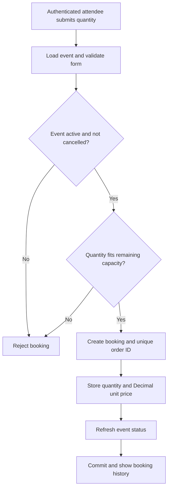
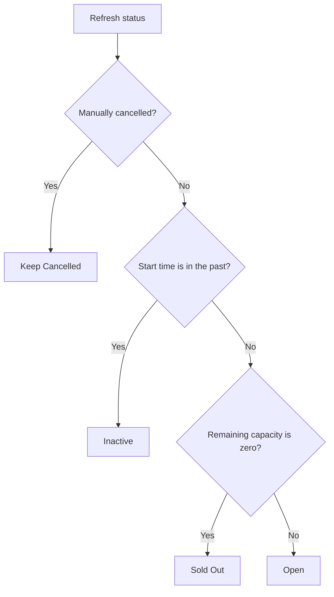
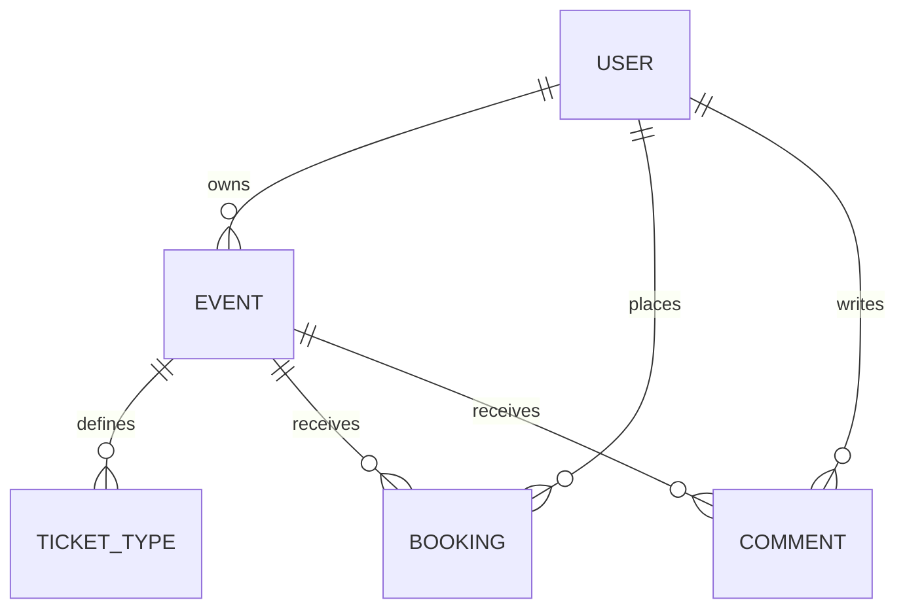

# Application workflows

## Booking decision flow

The route checks aggregate remaining event capacity. Ticket-tier records provide prices and capacity data; this does not establish transactional per-tier inventory reservation. Payments are simulated. Concurrent overselling prevention would require database transactions/locking beyond these checks.

## Event status

Status is recalculated by `Event.refresh_status` when relevant views are accessed, not by a background scheduler. Owner checks protect event editing, cancellation and deletion.

## Domain relationships

Booking totals use `Decimal` and fixed-precision columns. Passwords use Werkzeug PBKDF2 hashing. The Flask application factory registers authentication and main blueprints, initialises extensions and seeds the local demo catalogue.
